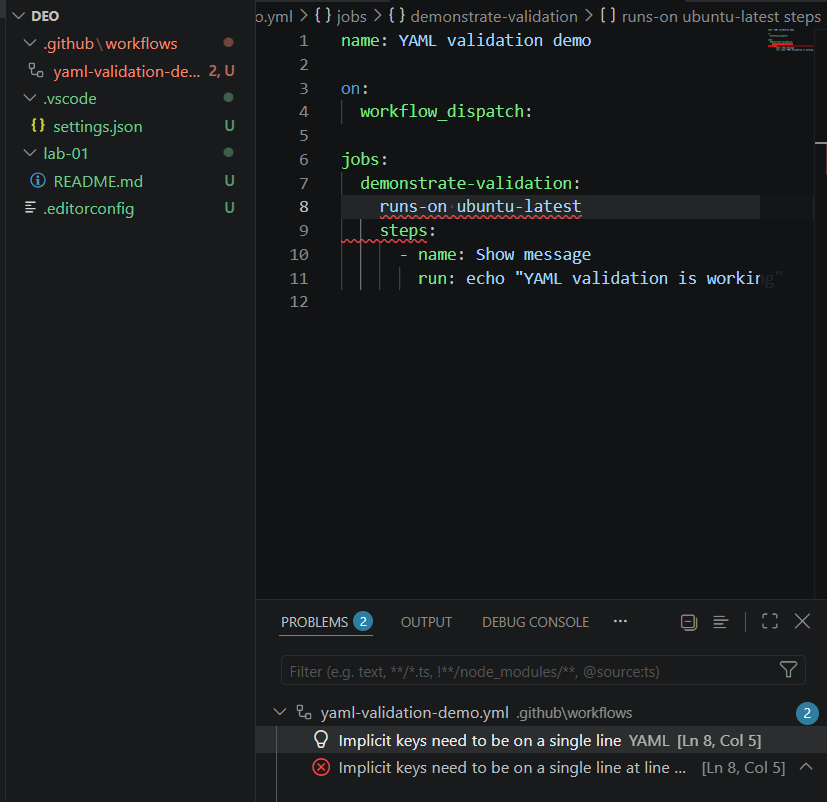

# Лабораторна робота №1

## Завдання 1. Git і редактор

### Глобальні параметри Git

Після налаштування команда `git config --list --global` повернула:

```text
user.name=Vitalina-ts
user.email=vitalina.tsykatiak@gmail.com
init.defaultbranch=main
core.autocrlf=true
core.editor=code --wait
pull.rebase=true
```

`user.name` та `user.email` записуються в метадані кожного коміту й показують, хто є його автором. Адреса має збігатися з підтвердженою адресою в GitHub, щоб сервіс міг правильно пов’язати коміти з обліковим записом користувача. Локальними командами неможливо підтвердити статус адреси в GitHub, тому користувачка має перевірити його вручну в налаштуваннях GitHub.

Параметр `init.defaultBranch=main` задає назву початкової гілки для нових репозиторіїв, створених командою `git init`.

### core.autocrlf

У Windows типовим завершенням рядка є CRLF, а в Unix/Linux — LF. Значення `core.autocrlf=true` під час отримання файлів із репозиторію перетворює LF на CRLF у робочій копії, а під час додавання до Git нормалізує завершення рядків назад до LF.

У Windows зазвичай застосовують `true`, а в Unix/Linux — `input` або `false`, залежно від правил проєкту. Без узгодженого налаштування в команді зі змішаними операційними системами Git може показувати весь файл як змінений, виникають зайві конфлікти, а shell-скрипти чи конфігураційні файли можуть некоректно оброблятися.

### pull.rebase

Параметр `pull.rebase=true` змушує `git pull` після отримання віддалених змін перенести локальні коміти поверх актуальної віддаленої гілки. Історія залишається лінійною. Типовий `git pull` із merge натомість об’єднує розбіжні гілки окремим merge-комітом.

Параметр `core.editor=code --wait` задає VS Code редактором для повідомлень комітів, інтерактивного rebase та інших операцій Git. Ключ `--wait` утримує Git у режимі очікування, доки файл у редакторі не буде закритий.

### Налаштування VS Code

Установлено такі розширення:

- `EditorConfig.EditorConfig` — застосовує правила форматування з `.editorconfig`.
- `eamodio.gitlens` — показує історію Git, авторство рядків і відомості про коміти.
- `ms-azuretools.vscode-docker` — додає підтримку Dockerfile, Compose і контейнерів.
- `redhat.vscode-yaml` — перевіряє синтаксис YAML і структуру документів за схемами.
- `github.vscode-github-actions` — підтримує та перевіряє workflow GitHub Actions.
- `yzhang.markdown-all-in-one` — полегшує написання, форматування та перегляд Markdown.

Локальні налаштування `.vscode/settings.json` вмикають форматування під час збереження, використання пробілів і LF. Вони не містять секретів або машинозалежних шляхів.

### EditorConfig

Файл `.editorconfig` задає однакові правила кодування, відступів, завершень рядків і видалення зайвих пробілів для різних редакторів та учасників команди. Це зменшує кількість суто форматувальних змін у Git.

EditorConfig не замінює `core.autocrlf`: редактор застосовує правила під час створення та збереження файлів, а Git контролює нормалізацію під час додавання файлів до індексу й отримання робочої копії. Разом ці механізми забезпечують передбачувані LF у репозиторії та зручну роботу на Windows.

### Перевірка YAML

Для демонстрації перевірки редактором було створено тимчасовий workflow із навмисною синтаксичною помилкою в рядку `runs-on ubuntu-latest`: після ключа `runs-on` була пропущена двокрапка. VS Code підсвітив рядок 8 і повідомив `Implicit keys need to be on a single line`. Помилку було виявлено до коміту, а тимчасовий workflow після створення скриншота видалено.



### Результати перевірки

Навмисно зламаний YAML-файл відсутній у фінальному стані. Структуру файлів, глобальні параметри Git, локальний стан репозиторію, список розширень, правила EditorConfig, Markdown-посилання та відсутність секретів перевірено перед завершенням роботи.

## Завдання 2. Середовища виконання

### Node.js і менеджер версій

Для керування Node.js установлено Fast Node Manager:

```text
fnm 1.39.0
```

Через `fnm` установлено актуальну LTS Node.js `24.20.0` (Krypton) і попередню LTS `22.23.2` (Jod). Актуальну LTS задано версією за замовчуванням:

```text
* v22.23.2
* v24.20.0 default
* system
```


У корені репозиторію створено `.node-version` зі значенням `24.20.0`. Разом із `fnm --use-on-cd` цей файл автоматично вибирає потрібну версію Node.js під час переходу до каталогу проєкту.

До користувацького профілю PowerShell без перезапису інших налаштувань додано ініціалізацію `fnm`. Перевірка в новій сесії з актуальним PATH автоматично активувала Node.js `24.20.0` із середовища менеджера.

### Демонстрація перемикання версій Node.js

Перемикання між двома реально встановленими версіями дало такі результати:

```powershell
fnm use 24.20.0
# Using Node v24.20.0
node --version
# v24.20.0
npm --version
# 11.19.0

fnm use 22.23.2
# Using Node v22.23.2
node --version
# v22.23.2
npm --version
# 10.9.8

fnm default 24.20.0
fnm use 24.20.0
# Using Node v24.20.0
node --version
# v24.20.0
npm --version
# 11.19.0
```

Після демонстрації активною та стандартною знову стала актуальна LTS `24.20.0`. Перевірка `Get-Command node` підтвердила запуск `node.exe` із середовища `fnm_multishells`, а не лише із системної інсталяції.

### Python і менеджер версій

Для керування Python установлено `uv`:

```text
uv 0.12.8 (68209e5c6 2026-08-31 x86_64-pc-windows-msvc)
```

Менеджер показав `3.14.7` як актуальний стабільний CPython; `3.15.0rc1` не обрано, оскільки це попередній release candidate. Python установлено та запущено через `uv`:

```powershell
uv run --python 3.14.7 python --version
# Python 3.14.7
```


Команда `uv python list` підтвердила наявність керованого `cpython-3.14.7-windows-x86_64-none`. Системний Python `3.13.5` не видалявся і не замінювався. Звичайна команда `python` у початковій і фінальній перевірках вказувала на WindowsApps alias і не запускалася, тому доказом керованої версії є саме команда `uv run`.

### Docker і Compose v2

Фактичні результати перевірки:

```text
Docker version 29.2.1, build a5c7197
Docker Compose version v5.1.0
Client Version: 29.2.1
Server Version: 29.2.1
Operating System: Docker Desktop
OSType: linux
Docker Root Dir: /var/lib/docker
```

`docker --version` перевіряє наявність і версію клієнта Docker CLI. Команда `docker compose version` підтвердила сучасний інтегрований Compose plugin `v5.1.0`. Він запускається правильною командою `docker compose` з пробілом, а не застарілою окремою командою `docker-compose`. `docker info` успішно отримав серверну інформацію, отже Docker Engine запущений. Для доступу до працюючого Engine активний контекст Docker змінено із застарілого `desktop-linux` на `default`.

Додаткова перевірка підтвердила не лише доступність Engine, а й успішний запуск контейнера:

```powershell
docker run --rm hello-world
# Hello from Docker!
# This message shows that your installation appears to be working correctly.
```

Docker CLI зв’язався з daemon, отримав образ `hello-world`, створив і запустив тимчасовий контейнер, а після завершення видалив його завдяки параметру `--rm`.

### Навіщо потрібні менеджери версій

Різні проєкти можуть вимагати різні версії Node.js або Python, а глобальне оновлення здатне зламати старий проєкт. Менеджер версій дозволяє встановити кілька версій поруч і швидко перемикатися між ними без видалення системних інструментів.

Файл версії в репозиторії допомагає всій команді використовувати однакове середовище. Це робить локальну розробку й CI/CD відтворюванішими та зменшує кількість помилок через відмінності версій.

### Результати перевірки

- `fnm 1.39.0` керує Node.js `24.20.0` і `22.23.2`.
- Перемикання між обома версіями Node.js фактично виконано; фінальна активна версія — `24.20.0`, npm — `11.19.0`.
- `uv 0.12.8` керує встановленим CPython `3.14.7`.
- Docker Client і Server `29.2.1`, а також сучасний Compose plugin `v5.1.0`, запущений командою `docker compose`, фактично перевірено.

Після виправлення користувацького PowerShell-профілю проведено незалежну ручну перевірку в повністю новій сесії. Менеджер і середовища залишилися доступними постійно. Повторна профільна перевірка дала такі результати:

```text
fnm --version
fnm 1.39.0

fnm list
* v22.23.2
* v24.20.0 default
* system

fnm current
v24.20.0

node --version
v24.20.0

npm --version
11.19.0

where.exe node
першим знайдено node.exe із середовища fnm_multishells
також присутній системний C:\Program Files\nodejs\node.exe

uv --version
uv 0.12.8

uv run --python 3.14.7 python --version
Python 3.14.7

docker version
Client 29.2.1 / Server 29.2.1

docker compose version
Docker Compose version v5.1.0

docker run --rm hello-world
Hello from Docker!
```

#### Фінальний чекліст Завдання 2

- [x] `fnm 1.39.0` доступний у новій PowerShell-сесії.
- [x] Node.js `22.23.2` і `24.20.0` установлені через `fnm`.
- [x] Перемикання між обома версіями Node.js перевірено.
- [x] Node.js `24.20.0` залишено активною версією та default.
- [x] Активна Node.js використовує npm `11.19.0`.
- [x] `.node-version` фіксує Node.js `24.20.0` для репозиторію.
- [x] `uv 0.12.8` запускає керований Python `3.14.7`.
- [x] Docker Client і Server `29.2.1` доступні.
- [x] Сучасний Compose plugin `v5.1.0` працює через `docker compose`.
- [x] Контейнер `hello-world` успішно запущено й автоматично видалено.
- [x] Системні Node.js і Python не видалялися.

## Завдання 3. GitHub і доступ

### Профіль GitHub

Вручну перевірено, що публічний профіль GitHub `Vitalina-ts` заповнений: указано ім’я, додано фотографію та короткий опис. Заповнений профіль допомагає іншим учасникам команди впізнати автора репозиторіїв, комітів і pull request.

### Двофакторна автентифікація

В обліковому записі GitHub вручну підтверджено ввімкнену двофакторну автентифікацію. Вона додає другий фактор перевірки та захищає обліковий запис, навіть якщо пароль стане відомий сторонній особі.

Recovery codes, QR-коди, 2FA secret та інші дані для відновлення або автентифікації у звіт і репозиторій не додаються.

### SSH-ключ

Для автентифікації створено пару SSH-ключів типу `ed25519`. Публічний ключ вручну додано до GitHub із назвою `Vitalina Windows laptop`. Повний вміст публічного та приватного ключів у звіті навмисно не наводиться.

Приватний ключ захищено парольною фразою. Вона шифрує приватний ключ на диску й ускладнює його використання сторонньою особою у випадку копіювання файла. Парольну фразу не можна зберігати в репозиторії або передавати іншим людям.

Приватний ключ є доказом особи власника та дозволяє автентифікуватися від його імені. Його не можна додавати в Git: після коміту ключ може залишитися в історії навіть після видалення з поточної версії файлів, а у віддаленому репозиторії чи його копіях він стане доступним іншим людям.

### Перевірка SSH-доступу до GitHub

У новій інтерактивній PowerShell-сесії вручну виконано:

```powershell
ssh -T git@github.com
```

GitHub успішно розпізнав обліковий запис і повернув:

```text
Hi Vitalina-ts! You've successfully authenticated, but GitHub does not provide shell access.
```

Це повідомлення підтверджує успішну SSH-автентифікацію. Відсутність shell-доступу є нормальною поведінкою GitHub. Автоматичний неінтерактивний тест без доступу до парольної фрази не зміг розблокувати ключ, тому доказом є ручна інтерактивна перевірка користувачки.

### Дії у разі витоку приватного ключа

Якщо приватний SSH-ключ став доступний стороннім особам, потрібно:

1. Негайно видалити відповідний SSH-ключ у налаштуваннях GitHub.
2. Вважати старий ключ скомпрометованим і більше його не використовувати.
3. Створити нову пару SSH-ключів із надійною парольною фразою.
4. Додати до GitHub новий публічний ключ.
5. Оновити локальні налаштування SSH та перевірити автентифікацію новим ключем.
6. Якщо приватний ключ потрапив у Git, очистити від нього всю Git-історію, а не лише видалити поточний файл.
7. Повідомити команду про інцидент і можливий ризик несанкціонованого доступу.
8. Перевірити журнал безпеки GitHub на підозрілі входи та дії.

### Результати перевірки

- [x] Профіль `Vitalina-ts` містить ім’я, фотографію та короткий опис.
- [x] Двофакторну автентифікацію ввімкнено.
- [x] Секрети 2FA та recovery codes не додано до репозиторію.
- [x] Створено SSH-ключ `ed25519`, захищений парольною фразою.
- [x] Публічний ключ додано до GitHub як `Vitalina Windows laptop`.
- [x] Команда `ssh -T git@github.com` успішно підтвердила обліковий запис `Vitalina-ts` під час ручної інтерактивної перевірки.
- [x] Приватний ключ і його парольну фразу не додано до репозиторію.
- [x] Описано повну послідовність дій у разі компрометації ключа.
